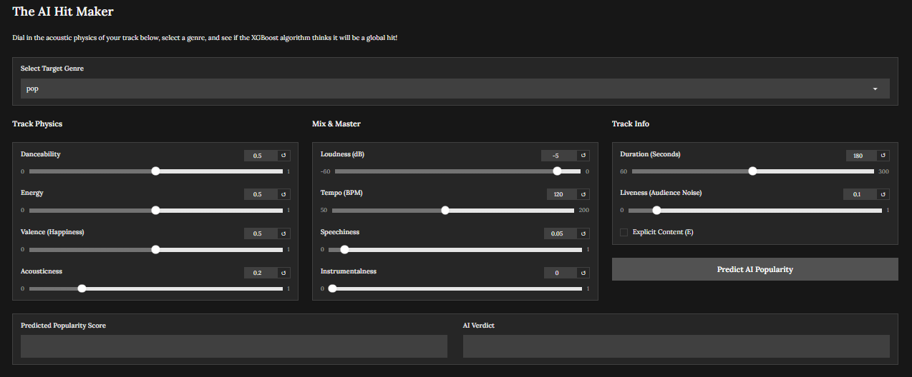

# Spotify Song Popularity Prediction Pipeline

An end-to-end Machine Learning ecosystem featuring dual-headed **XGBoost architecture** designed to predict song track popularity scores via regression and classify commercial viability ("Hit" vs. "Flop") based on calculated musical data vectors. 

## Key Architectural Features
* **Dual-Headed Predictive Model:** Leverages `XGBRegressor` for exact performance expectations (continuous scaling) alongside an optimized `XGBClassifier` to flag commercial viability thresholds.
* **Engineered Audio Indexes:** Constructs composite metrics to calculate perceived tracking energy:
  * `banger_index` = Danceability × Normalized Loudness × Energy Vector
  * `chill_index` = Valence (Musical Happiness) × Acoustic Footprint
* **Class Balancing Management:** Corrects native population tracking bias (Hits represent a clear minority) by computing synthetic structural sample balancing weights (`compute_sample_weight`).
* **Microservice Architecture:** Decouples core framework calculation processing layers (`FastAPI`) away from responsive visual operational controllers (`Gradio`).

## How to Run Locally

### 1. Set Up Environment
```bash
python -m venv venv
source venv/Scripts/activate  # Windows: .\venv\Scripts\Activate.ps1
pip install -r requirements.txt
```

### 2. Launch FastAPI Backend Service
```bash
uvicorn app:api --reload
```

### 3. Initialize Gradio Dashboard
```bash
python frontend.py
```

## 📊 Model Performance & Insights

### 1. Feature Importance
The XGBoost classifier revealed fascinating insights into what mathematically constitutes a "Hit". Extracting the feature importances highlighted the top three commercial drivers:
1. **`genre_mean_popularity`**: Overwhelmingly the strongest predictor, indicating that baseline genre trends heavily dictate a track's commercial ceiling.
2. **`explicit`**: The presence of explicit content is a major distinguishing factor in modern charting tracks.
3. **`instrumentalness`**: Highly predictive, as mainstream hits strongly favor vocal-driven mixing over heavy instrumental presence.


### 2. Classification Evaluation (Hit vs. Flop)
Because "Hits" are a severe minority class in the music industry (~11% of the test set), the `XGBClassifier` was trained using `scale_pos_weight`to prevent the model from blindly predicting "Flop" every time.

**Overall Test Accuracy:** 88.35%

| Class | Precision | Recall | F1-Score | Support |
|-------|-----------|--------|----------|---------|
| **Flop (0)** | 0.94 | 0.92 | 0.93 | 9,258 |
| **Hit (1)** | 0.40 | 0.71 | 0.51 | 1,183 |

* **Confusion Matrix Insight:** The model successfully identified 836 true hits out of the test set. By utilizing class weights, the model is tuned to be slightly more aggressive in predicting hits (sacrificing some precision for a 71% recall rate). This makes it a highly optimized tool for A&R teams who would rather cast a wider net than accidentally miss a potential breakout track.


### 3. Regression Performance (Popularity Score)
The `XGBRegressor` evaluates the continuous popularity grading (0-100 scale). It maintains highly consistent error rates across all data splits, proving the model is not overfitting:
* **Training RMSE:** 11.12
* **Validation RMSE:** 12.14
* **Test RMSE:** 12.39

## 📸 Application Interface
The Gradio frontend provides a clean, responsive dashboard for users to tweak track parameters and simulate different mixing & mastering choices to see how it affects the AI's predicted popularity score.



